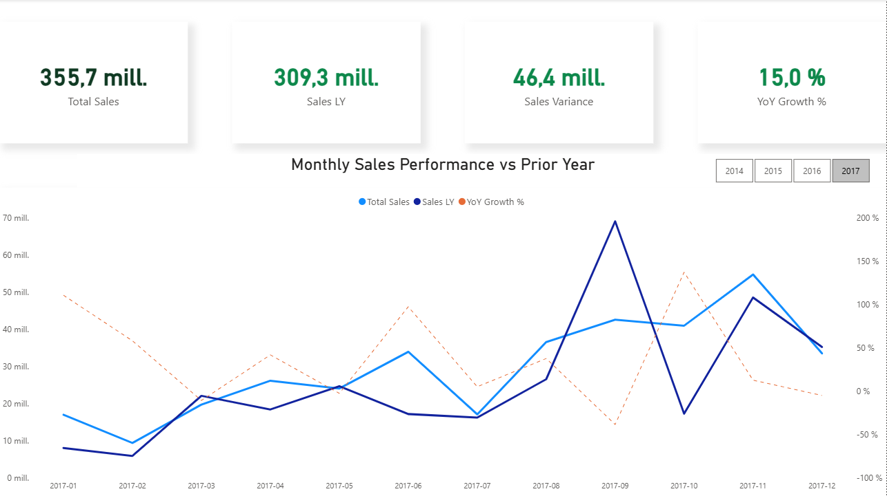

# Power BI – Superstore Sales Dashboard

## Overview
Interactive Power BI report built on the Superstore dataset to analyze monthly sales performance vs prior year and performance by category/segment.

## Pages
### 1) Executive Overview
- KPIs: Total Sales, Sales LY, Sales Variance, YoY Growth %
- Monthly trend: Total Sales vs Sales LY + YoY Growth %

### 2) Category & Segment Performance
- Sales by Category vs Last Year
- Profit by Category
- Sales by Segment

## Key Measures (DAX)
- Total Sales
- Sales LY
- Sales Variance
- YoY Growth %

## How to use
1. Download the `.pbix` file
2. Open with Power BI Desktop
3. Use slicers (Year / Segment / Category) to filter the report
